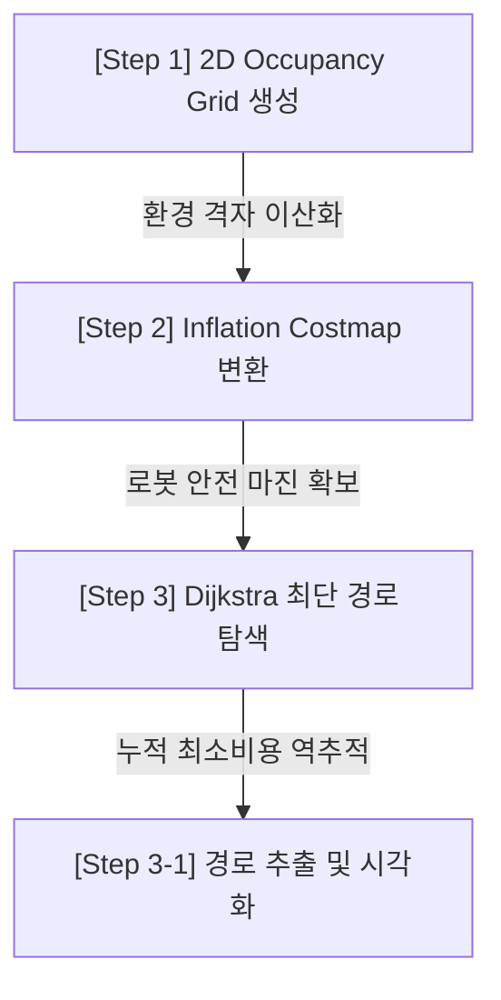
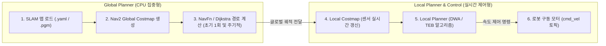

# 🎓 [강의 노트] 복잡한 공간에서의 글로벌 경로 계획: Dijkstra와 Costmap의 학문적 및 실무적 이해

* **작성자:** 지도 교수  
* **일자:** 2026년 05월 26일  
* **대상 과목:** 로봇 자율주행 및 모바일 로보틱스 (Mobile Robotics & Autonomous Navigation)  
* **참조 실습 노트북:** `practice/14.03.01.Dijkstra.ipynb`  

---

## 📌 0. 들어가며 (강의 목적)

자율주행 모바일 로봇이 임의의 지도 상에서 스스로 충돌 없이 목적지까지 도달하기 위해서는 **글로벌 경로 계획(Global Path Planning)** 능력이 필수적입니다. 본 실습은 자율주행 로봇 공학의 사실상 표준(de facto standard)인 **ROS 2 Nav2 내비게이션 스택**이 글로벌 경로를 생성하는 내부 수학적·알고리즘적 메커니즘을 파이썬 코드로 직접 구현하고 체감하는 것을 목표로 합니다.

단순히 "최단 경로를 찾는다"는 수학적 접근을 넘어, **실제 모바일 로봇의 물리적 크기**와 **충돌 위험도(Safety Margin)**를 알고리즘에 어떻게 반영하는지(Inflation Costmap), 그리고 이를 연산하기 위한 최적의 그래프 탐색 기법(Dijkstra)은 무엇인지를 학문적/실무적 관점에서 종합적으로 강의하겠습니다.

---

## 🔑 1. 핵심 키워드 및 연관 이론 (Theoretical Foundations)

이 실습을 완벽하게 이해하기 위해 여러분이 반드시 정립해야 할 학술적 개념들입니다.

### ① Occupancy Grid Map (점유 격자 지도)
* **정의:** 연속적인 물리 세계(Real World)를 일정 크기의 격자(Cell)로 이산화(Discretization)하여, 각 격자가 장애물에 의해 점유되었을 확률을 표현하는 공간 모델입니다.
* **해상도 (Resolution, $RES$):** 격자 한 칸이 물리 세계에서 가지는 가로·세로 미터(m) 크기입니다. 본 실습의 해상도는 **$0.1\text{ m/cell}$**로, $100 \times 100$ 격자는 곧 물리 세계의 $10\text{ m} \times 10\text{ m}$ 영역에 대응합니다.
* **학습 포인트:** 해상도가 높을수록 정밀한 경로 계획이 가능하지만, 셀 개수가 늘어나 연산 부하가 기하급수적으로 증가하는 트레이드오프(Trade-off) 관계에 있습니다.

### ② Inflation Costmap (인플레이션 비용지도)
로봇은 단순한 '점(Point)'이 아니라 '부피'를 가진 물리적 객체입니다. 따라서 벽에 딱 붙어서 가는 최단 경로는 로봇의 실제 주행 시 충돌을 유발합니다. 이를 극복하기 위해 **장애물의 영역을 로봇의 반경만큼 팽창(Inflation)**시키고 주변 영역에 점진적인 패널티 비용을 부여하는 기법입니다.

| Cost 구분 | Cost 범위 | 의미 및 로봇 거동 |
| :--- | :--- | :--- |
| **Lethal (치명)** | $254$ | 장애물 자체 또는 장애물 중심점. 절대 진입 불가능. |
| **Inscribed (접촉 위험)** | $253$ | 장애물 경계로부터 **로봇 반경(Robot Radius)** 이내 구역. 로봇 중심이 이 영역에 진입하면 외곽부가 반드시 장애물과 충돌합니다. |
| **Inflation Gradient** | $128 \sim 252$ | 안전 마진 구역. 거리가 멀어질수록 비용이 지수함수적으로 감쇄합니다 ($cost \propto e^{-\alpha \cdot dist}$). 로봇은 이 구역을 통과할 수 있으나 가급적 기피합니다. |
| **Free (자유 구역)** | $0 \sim 127$ | 완벽하게 안전하게 이동할 수 있는 공간입니다. |

* **Euclidean Distance Transform (EDT):** 모든 자유 공간 셀에서 가장 가까운 장애물까지의 '최단 직선 거리'를 구하는 연산입니다. 실무에서는 연산 가속을 위해 전용 EDT 필터 라이브러리(`scipy.ndimage.distance_transform_edt`)를 사용합니다.

### ③ Dijkstra's Algorithm (다익스트라 알고리즘)
* **수식 정의:** $f(n) = g(n)$  (단, $h(n) = 0$)
  * $g(n)$: 출발지에서 현재 노드 $n$까지 도달하는 데 소요된 누적 비용.
  * $h(n)$: 현재 노드에서 목적지까지의 예상 거리(휴리스틱). Dijkstra는 목적지의 방향 정보가 없으므로 항상 $0$입니다.
* **탐색 거동:** 출발지로부터 사방으로 물결(Wavefront)처럼 퍼져나가며 모든 격자의 최소 누적 비용을 확정짓습니다.
* **핵심 자료구조:** **우선순위 큐(Priority Queue / Min-Heap)**. 누적 비용 $g(n)$이 가장 작은 노드를 O(log N) 시간에 효율적으로 꺼내기 위해 사용됩니다.

---

## 💻 2. 코드의 의도와 단계별 분석 (Code Intent)

노트북 코드의 각 Step은 로봇 자율주행 파이프라인의 핵심 모듈들을 체계적으로 모사하고 있습니다.

### 📍 Step 1: Occupancy Grid Map 생성
* **의도:** 물리적인 지도 데이터(지형 정보)를 입력받아 격자 상태 배열로 구조화합니다.
* **핵심 최적화(NumPy Vectorization):** 원래 코드는 `for` 중첩 루프로 수만 번 비교했지만, 이는 교육 환경용입니다. 실제 대규모 맵에서는 좌표 그리드(`np.meshgrid`)를 생성하여 모든 셀에 대해 한 번에 행렬 연산으로 마스킹하는 것이 실무 표준입니다.

### 📍 Step 2: Inflation Costmap 생성
* **의도:** 정밀 기하 장애물 정보에 **로봇의 역학적 특성(로봇 반경 $0.25\text{ m}$ 및 안전 마진 $0.5\text{ m}$)**을 융합하여 '비용 지도'로 변환합니다.
* **수학적 의도:** 거리에 따른 비용 변화 식은 다음과 같습니다.
  $$cost = inscribed\_cost \times e^{-5.0 \times \frac{dist - robot\_radius}{inflation\_radius}}$$
  이 지수 감쇄 공식 덕분에 로봇은 벽에서 최대한 멀리 떨어져 방 구석이 아닌 복도 중앙으로 달리는 **"안전 지향적 자율주행"** 경로를 계획할 수 있게 됩니다.

### 📍 Step 3: Dijkstra 경로 탐색
* **의도:** 비용 지도 위에서 출발지와 목적지를 잇는 최적의 노드 시퀀스를 찾아냅니다.
* **알고리즘 흐름:**
  1. 출발지 격자의 비용을 $0$으로 두고 **우선순위 큐**에 삽입합니다.
  2. 큐에서 비용이 가장 적은 셀을 꺼내 `visited` (Closed List)에 등록합니다.
  3. 이웃한 8방향 셀들의 비용을 계산하여 갱신합니다.
     * 이웃 셀로 이동하는 총 비용: `이동 거리 비용(Diagonal / Orthogonal) + 셀의 코스트 패널티`
  4. 목적지에 도달할 때까지 위 과정을 반복한 후, 기록된 `parent` 정보를 역추적(Backtracking)하여 최적 경로를 재구성합니다.

---

## 🚀 3. 현실적인 실무 적용 Flow (Deployment & Integration)

연구실에서 작성한 파이썬 알고리즘을 **실제 상용 실내 물류 로봇이나 안내 로봇에 배포(Deployment)**할 때의 현실적인 시스템 파이프라인입니다.

### 1단계: SLAM 지도의 오프라인 로드
* 실무에서는 지도 작성(SLAM) 단계에서 얻은 `.yaml` 기술 파일과 `.pgm` 격자 이미지 파일을 `map_server` 노드가 메모리에 로드하며, 이는 본 노트북의 `Step 1`과 완전히 매칭됩니다.

### 2단계: Global Costmap 레이어 빌드
* ROS 2 Nav2 스택에서는 `global_costmap` 모듈이 작동합니다. 이 모듈은 센서 데이터 레이어, 정적 지도 레이어, 그리고 **인플레이션 레이어(Inflation Layer)**를 겹쳐 최종 비용지도를 생성합니다 (`Step 2`에 매칭).

### 3단계: Global Planner 실행 (NavFn)
* 로봇이 출발하기 직전, `NavFn` 또는 `SmacPlanner` 플러그인이 탑재된 글로벌 플래너가 작동합니다.
* 이때 **Dijkstra** 알고리즘을 사용해 장애물을 우회하는 청사진(Global Path)을 단 한 번 계획합니다 (`Step 3`에 매칭).

### 4단계: Local Planner(로컬 플래너)와의 연동
* 글로벌 경로가 나오면, 로봇은 바로 출발합니다. 이때 실시간으로 움직이는 사람이나 동적 장애물은 글로벌 플래너가 알지 못합니다.
* 따라서 로봇 주변의 작은 영역($3\text{ m} \times 3\text{ m}$)을 실시간 LiDAR 센서 데이터로 갱신하는 **Local Costmap**을 유지하며, **TEB(Timed Elastic Band)** 또는 **DWA(Dynamic Window Approach)** 로컬 플래너가 글로벌 경로를 추종하면서 동적 장애물을 회피하는 구동 속도($v, \omega$)를 20Hz 주기로 연산하여 모터 드라이버에 전송합니다.

---

## 👨‍🏫 4. 교수님의 조언 및 실무적 제언 (Instructor's Pro-Tips)

### 💡 실무 한계점 1: Dijkstra vs A* 알고리즘
Dijkstra 알고리즘은 **시작점을 기준으로 전방위로 퍼져나가기 때문에** 목적지와 상관없는 반대 방향의 노드들까지 불필요하게 전부 탐색합니다. 
* **해결책:** 실무에서는 목적지 방향으로 가중치를 부여하는 **휴리스틱 함수(Heuristic Function, Manhattan/Euclidean Distance)**가 결합된 **A\*** 또는 실시간 맵 변화에 강인한 **D\*** 계열 플래너를 사용합니다. 여러분은 실습 15장 다음 단계인 `14.03.02.Astar.ipynb` 노트북을 공부하며 Dijkstra와 A*의 탐색 면적(Visited Nodes) 차이를 시각적으로 비교 분석하길 바랍니다.

### 💡 실무 한계점 2: 로봇의 비홀로노믹(Non-holonomic) 제약
Dijkstra나 A*로 찾은 격자 경로는 계단식(Grid-based) 지그재그 경로입니다. 모바일 로봇(예: 차륜형 Differential Drive 로봇)은 회전 반경 제약이 있어 이 경로를 그대로 따라가지 못합니다.
* **해결책:** 로봇 공학자들은 글로벌 경로 탐색 후, 경로를 부드럽게 깎아주는 **Path Smoothing (경로 평활화)** 알고리즘(예: B-Spline, Bezier Curve)을 추가 적용하거나, 탐색 단계부터 차량의 조향 제약을 고려한 **Hybrid A\*** 알고리즘을 채택합니다.

---

## ❓ 5. 복습 질문 (Discussion Questions)
오늘 수업 내용을 정리하며 다음 세 가지 질문에 스스로 답해보세요.

1. **로봇 반경(Robot Radius)보다 인플레이션 반경(Inflation Radius)을 지나치게 크게 설정할 경우, 좁은 문이나 통로가 존재하는 맵에서 글로벌 경로 계획이 어떻게 동작할지 설명해보시오.**
2. **Dijkstra 알고리즘에서 대각선 이동 비용을 단순히 상하좌우와 동일한 `1.0`으로 설정했을 때 발생할 수 있는 부작용(Side effect)은 무엇인가?**
3. **글로벌 플래너와 로컬 플래너의 실행 주기(Frequency) 및 담당하는 역할의 물리적 범위가 다른 이유를 연산 자원(Computational Resource)의 관점에서 논하시오.**
